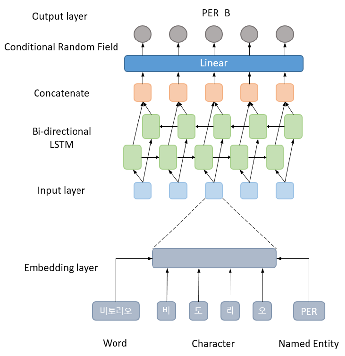
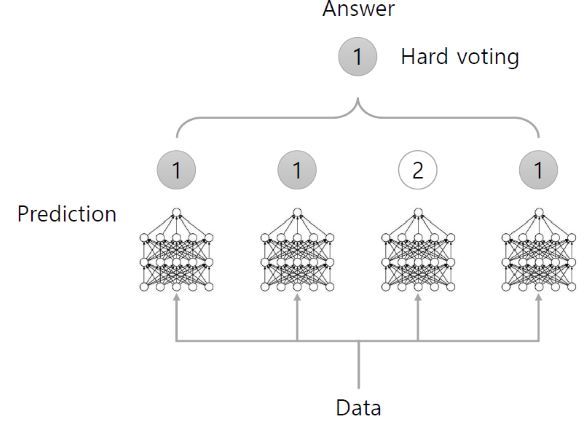

# [Naver NLP Challenge 2018](https://github.com/naver/nlp-challenge)
Named Entity Recognition Model for Naver NLP Challenge 2018  
__[Presentation file](asset/nlp_challenge.pdf)__

## NER model for Naver NLP Challenge 2018
Team : State_Of_The_Art (박동주)  
1st place on Naver NLP Challenge 2018 NER task  

## NER model architecture
  

* The code is implemented based on [baseline model](https://github.com/naver/nlp-challenge/tree/master/missions/ner)
* Bidirectional LSTM + CRF
* Embedding layer consists of Word, character(LSTM), and named entity together
* Shuffle training data on every epoch
* Total data : __90000__, training data : __80000__, development data : __10000__
* Important to use RMSPropOptimizer as an optimizer and low value of learning rate 
* The model is an ensemble model that uses hard voting method for ___N___ different models  

## Hyper-parameters
Hyper-parameter|value
:---------------:|:-----:
epoch |20
batch_size|128
learning_rate|0.001
keep_prob|0.65
word_embedding_size|128
char_embedding_size|128
tag_embedding_size|128
lstm_units|128
char_lstm_units|128
sentence_length|180
word_length|8
num_ensemble|3

- Converge between 13 and 15 epochs  
- In this code, the default value of num_ensemble is set to __5__, but I set it to __3__ when submitting the model

## Result

#### 1st place on NER task
- [Named Entity Recognition(NER) Leaderboard](http://air.changwon.ac.kr/?page_id=10)

## Link
[Naver NLP Challenge](https://github.com/naver/nlp-challenge)  
[Changwon University Adaptive Intelligence Research Lab.](http://air.changwon.ac.kr/)  
[NER Leaderboard](http://air.changwon.ac.kr/?page_id=10)  
# NER-NamedEntityRecognition-
# NER-NamedEntityRecognition-
